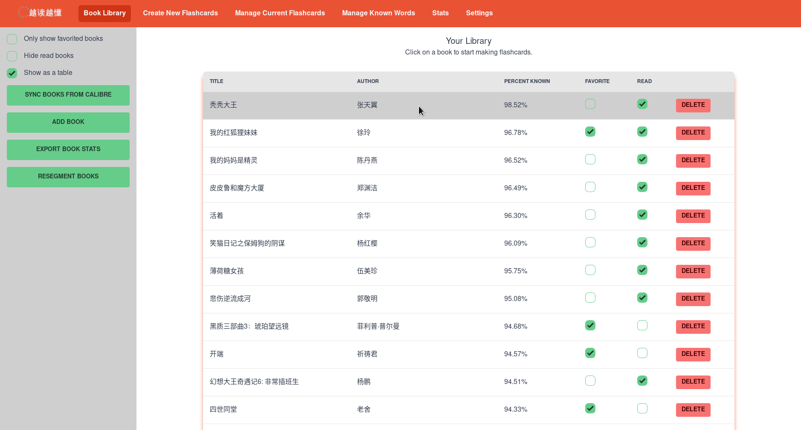
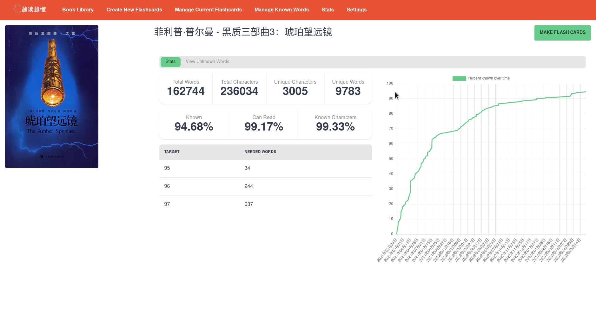
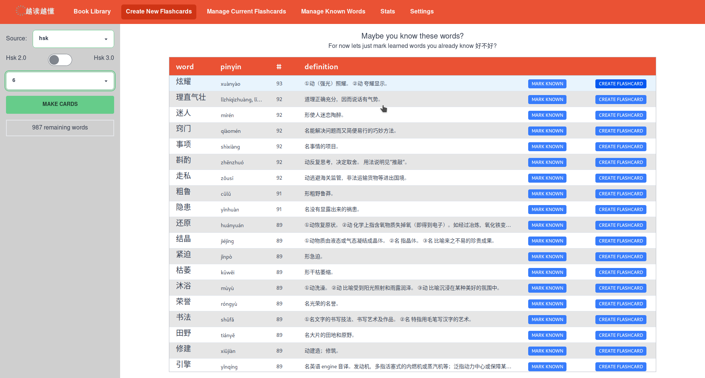
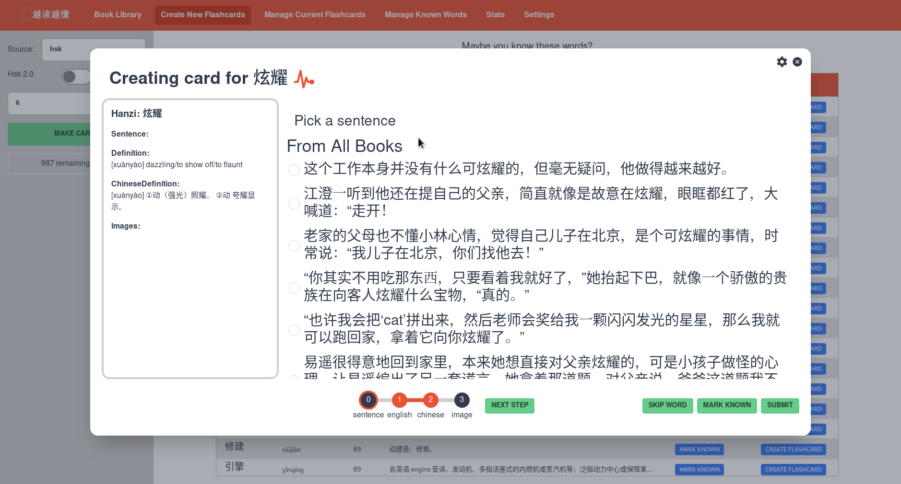
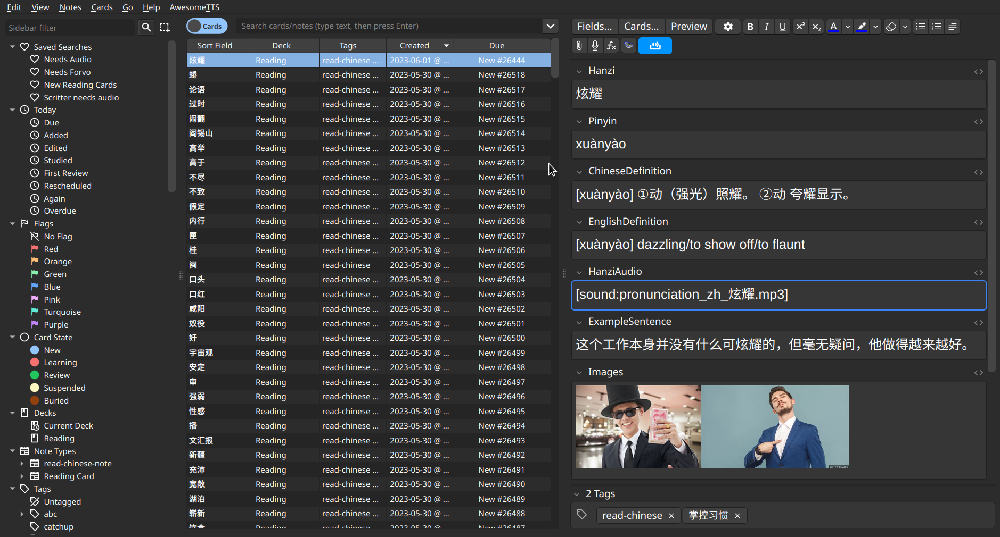
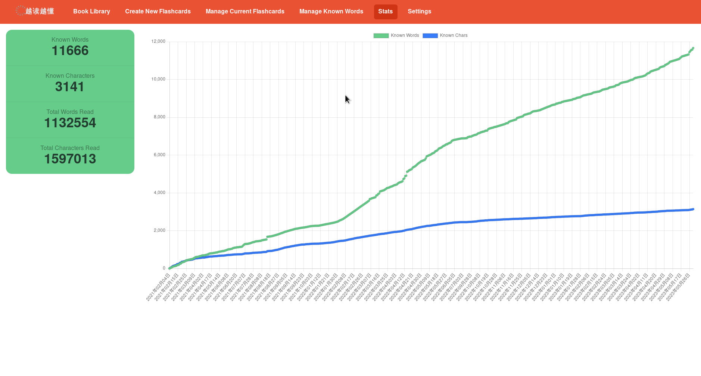

# read-chinese

## Blocking issues
Currently the following have to be implemented before I would recommend any
random person on the internet tries to use this

* I need to make a guide on how to get your own Azure api keys
* I need to make a guide on how to import known word lists

## What is this?
### Who is this for
Intermediate to Advanced learners with 
* a vocab of (at least) 1000 characters, and 2000 known words.
* an interest in reading 
* experience using Anki

### How it works

Assuming you have correctly setup Anki, and the required Azure apikeys, the workflow looks like this
#### Manage BookLibrary
You can manage your books from the book library. Those marked as 'favorite' are books that you plan on reading next.

Clicking on a row will open more detailed overview of that book, including character and word counts,
as well as infomation on how many words you need to learn to hit the next comprehension target.

You can start creating flashcards that focus on the vocab of a particular book from the BookStats page, or you can 
head over to the Create New Flashcards page for more options. Here we see my still unknown words from HSK 6, ordered 
by the frequency that they appear in my book library

If you already recognize a word, you don't need to make a flashcard for it and can just mark it as already known. 
Otherwise we can move onto the card creation workflow. 

You first select from T1 sentences mined from your book library. 
This allows you to study the word in context within Anki

After also selecting the definitions you want from installed dictionaries, if you have entered a 
Azure Image ApiKey, you can also select multiple images to go on the flashcard

Upon submiting the card, it will be sent to Anki, here you can see the above card in my Anki deck, 
along with others I have recently created

Finally here is the progress I have made in the past year and a half of using this program. 
(Pre 2022 is data backfilled from skritter)

### Getting Started

#### Setup (I hope to automate much of this soon)
1. Acquire a ebook copies of the books you want to read. 
2. Load these books into calibre and 'convert' them to txt format.
3. Sync the books from calibre to read-chinese
4. (Ideally) Either import a list of known words, or sync from Anki your known words
6. Generate your own azure api keys for the free image and tts services

#### Making the flashcards

1. Click on the book you want to study for
2. Click 'Make Flashcards' button
3. Go go go

### What is this trying to accomplish
I have spent a much of my time learning Chinese through reading, as reading is
a hobby I enjoy outside of language learning, and I think it is a great way to
pick up new vocab. I don't like reading using a computer, and I tend to like
smaller phones, so I have tended to stick to reading on either a kindle or
physical books. This makes it harder to lookup the pronunciation / meaning of
new words, so I rely a bit more heavily on 'prestudying' for a book, making
sure to learn the highest frequency unknown words and characters ahead of time.

Early on the biggest time sink for this was actually creating the flashcards.
Even using other available tools for this I would spend up to 2+ hours creating
40 high quality flashcards. Since I would also try to review 20 new cards a day
at the time, this meant I was spending at least an hour each day just making
cards. This felt like a pretty big waste of time so I wanted to focus on making
a program that would speed up this process for me.

At this point it feels like I can make those same 40 flashcards in only 20
minutes now, so I think it does what I need pretty well.

### Some Drawbacks
I think the biggest criticism I would have of this is approach is that the long
term benefit of creating flashcards for only the most frequent words is that
you would probably acquire these words anyways if you just read the book. 

There might be a more efficient order in which prioritize words (and would be
happy to implement such an ordering) but for now more frequent is easiest, since
those words will tend to have more T1 sentences to choose from.

## Development
### Dependancies:
Let me know if something else is needed that I am not aware of

* [calibre](https://calibre-ebook.com/download)
* [wails](https://wails.io/docs/gettingstarted/installation) (make sure to add $HOME/go/bin to path)
* [yarn](https://yarnpkg.com/getting-started/install)
* some sort of c++ compiler (to compile the Jieba implementation)

### to run dev mode:
`wails dev`

### to build
`wails build`

Currently I am using the following flags to create the windows installer. This
is because I primarily develop and test on linux and want to get the most info
possible out of problems when they happen on windows

`wails build -nsis -windowsconsole -debug`
